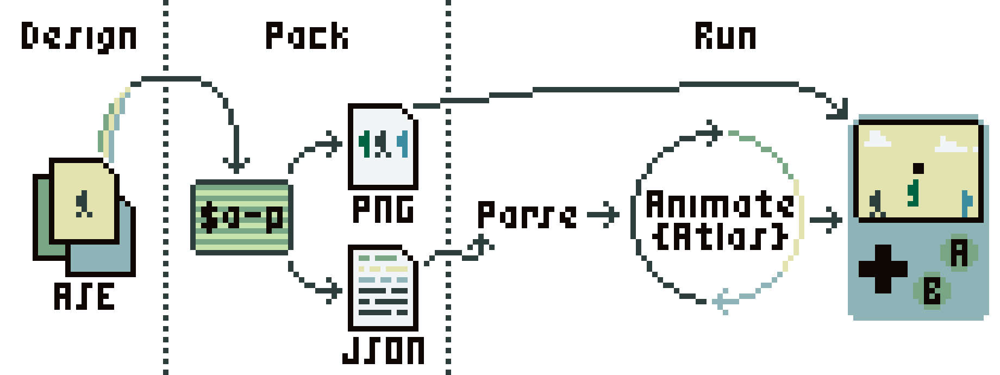

# 🗺️ [aseprite-atlas](https://git.io/aseprite-atlas)

aseprite-atlas is an Aseprite sprite sheet parser, animator, and toolset for the
browser and Node.js. See [installation](#installation) and the
**[minimal example](#minimal-example)** to get started.

## Table of Contents

<!-- @import "[TOC]" {cmd="toc" depthFrom=2} -->
<!-- code_chunk_output -->

- [Table of Contents](#table-of-contents)
- [Installation](#installation)
- [Sprite Sheets and Atlases](#sprite-sheets-and-atlases)
- [Usage](#usage)
  - [Overview](#overview)
  - [Pack the Sprite Sheet (CLI)](#pack-the-sprite-sheet-cli)
  - [Parse and Render (JavaScript)](#parse-and-render-javascript)
    - [Minimal Example](#minimal-example)
      - [Parsing](#parsing)
      - [Retrieve an Animation from the Atlas](#retrieve-an-animation-from-the-atlas)
      - [Create an Animator and Animate It](#create-an-animator-and-animate-it)
      - [Render the Animation](#render-the-animation)
- [Features](#features)
- [Functionality Not Provided](#functionality-not-provided)
- [Known Issues](#known-issues)
- [Assumptions and Conventions](#assumptions-and-conventions)
  - [Assumptions](#assumptions)
  - [Conventions](#conventions)
- [Development](#development)
- [License](#license)
  - [GPL-3.0-only](#gpl-30-only)

<!-- /code_chunk_output -->

## Installation

Execute `npm i -E aseprite-atlas` to install aseprite-atlas. See the
[changelog](docs/changelog.md) for release notes.

## Sprite Sheets and Atlases

Sprite sheets, also known as atlases, maximize GPU texture mapping unit and bus
bandwidth performance by packing logical individual textures together into
larger texture compositions. These necessary efficiency gains increase
complexity as textures no longer map directly to distinct files but instead must
be looked up by coordinates.

The following example sprite sheet was generated from two files,
[frog.aseprite](src/demo/frog.aseprite) and
[backpacker.aseprite](src/demo/backpacker.aseprite), using
[`aseprite-atlas-pack`](#generate-the-atlas-cli). The frog has a single
eight-frame animation and the backpacker has three animations, one nine-frame
and two eight-frames. All frames are embedded in a single, static sprite sheet
PNG file. Any animation can be rendered programmatically from this file, such as
this one of the backpacker walking right.

<div align="center">
  
</div>

_Above left: All animation frames are embedded into a single PNG. Above right:
Any sub-textures from the sheet can then be efficiently rendered._

Although this readme is constrained to use GIFs for animation, an aseprite-atlas
consumer would instead render all animations from the static sprite sheet PNG
file as shown in the
[API demo](https://aseprite-atlas.netlify.com/src/demo/demo.html).

Some or all embedded sprites may not be animated. For example, a common use case
for sprite sheets is drawing text:

<div align="center">
  
</div>

_Above: A complete font embedded in a single sprite sheet._

## Usage

### Overview

<div align="center">
  
</div>

There are three steps in the workflow:

- **Design**: Aseprite pixeling as per usual. Draw, tag, and slice sprites
  across `*.aseprite` files as wanted.
- **Pack**: Concatenate all Aseprite rendered outputs using
  `aseprite-atlas-pack` as part of a project's build process. A single, big PNG
  sprite sheet containing all frames of animation from all input files as well
  as an associated JSON texture lookup file are output.
- **Run**: Parse the sprite sheet JSON and generate an immutable sprite `Atlas`
  optimized for lookup and sharing. Every distinct renderable object should then
  create its own `Animator` state. Finally, `Animator` is used to update and
  render the `Animation` state sub-textures each frame.

Aseprite itself provides everything needed. However, the latter two steps
benefit from the tooling provided by aseprite-atlas:

- `aseprite-atlas-pack`: A thin wrapper around the Aseprite executable with the
  defaults expected by the `Parser`.
- `Parser`: Accepts a sprite sheet JSON file and outputs an immutable `Atlas`
  for efficient `Animation` sub-texture lookup. A program has one `Atlas` object
  per sprite sheet.
- `Animator`: The current playback state for a given `Animation`. There are
  often multiple distinct `Animator`s associated with the same `Animation`. A
  renderer should consult `Animator` states to determine the appropriate
  sub-texture regions to blit from the `Atlas` each loop.

See the [API demo source](src/demo/demo.ts)!

### Pack the Sprite Sheet (CLI)

Given a list of Aseprite files, pack all images and animations into a single
sprite sheet:

```sh
npx aseprite-atlas-pack --sheet atlas.png --data atlas.json *.aseprite
```

The output is a big image of sprites (`atlas.png`) and an
[`Aseprite.File`](src/lib/types/aseprite.ts) (`atlas.json`) which is ready for
parsing. These outputs should be regenerated any time assets (Aseprite files)
change, usually as part of a build step.

<details markdown>
<summary>💡 Troubleshooting…</summary>

The tool expects Aseprite and Node.js executables to be installed and in the
system environment `PATH`. If you get a command not found error, you probably
need to revise your `PATH` before running the tool. _Something_ like:

```bash
# Add the Aseprite and Node.js binary executable folders to the command path
# lookup environment variable. Linux, macOS, and Windows operating systems all
# have the notion of system paths that are searched whenever executing a command
# in the command line terminal, although the program locations and syntaxes may
# vary.
#
# In this example for Bash on Linux, any previously set locations are searched
# first. It's usually a good idea to preserve these locations. A delimiter, `:`
# separates the second path to search,
# `/Applications/Aseprite.app/Contents/MacOS` where we hope to find an
# executable named `aseprite`. A second delimiter follows, and finally a made up
# location to Node.js binaries like `npx` for purposes of example.
export PATH="$PATH:/Applications/Aseprite.app/Contents/MacOS:/path/to/node/bin"

# Execute the tool (same as noted above).
npx aseprite-atlas-pack --sheet atlas.png --data atlas.json *.aseprite
```

If the tool executes without any errors, no need to worry about changing the
`PATH`.

</details>

### Parse and Render (JavaScript)

Once `atlas.json` and `atlas.png` are available, a program can parse
`atlas.json` to animate and render animations from `atlas.png`. A complete but
minimal example follows. Subsequent sections detail each step in the example.

#### Minimal Example

All together, parse the packed sprite sheet and play the frog's idle animation:

```js
import {Animator, Parser} from 'aseprite-atlas'
import * as asepriteJSON from './atlas.json'

const atlas = Parser.parse(asepriteJSON)

const animation = atlas.animations['frog-idle']
const animator = Animator()

Animator.animate(animator, 16.667, animation)
const {x, y} = Animator.cel(animator, animation).position
const {w, h} = animation.size
console.log(x, y, w, h)
```

`Animator.animate()` usually occurs within a loop.
[See the API demo](https://aseprite-atlas.netlify.com/src/demo/demo.html) for a
running example rendered to a canvas.

The following sections only detail the above example.

##### Parsing

Parse the `Aseprite.File` into an `Atlas`:

```js
import {Parser} from 'aseprite-atlas'
import * as asepriteJSON from './atlas.json'
// Or:
//   const {Parser} = require('aseprite-atlas')
//   const asepriteJSON = require('./atlas.json')

// Parse the Aseprite.File (atlas.json) into an Atlas.
const atlas = Parser.parse(asepriteJSON)
```

##### Retrieve an Animation from the Atlas

Animations are stateless and are retrieved by Aseprite tag:

```js
// Retrieve the Alas.Animation tagged "frog-idle".
const animation = atlas.animations['frog-idle']
```

##### Create an Animator and Animate It

```js
import {Animator} from 'aseprite-atlas'
// Or: const {Animator} = require('aseprite-atlas')

// Create a mutable Animator state. Animators keep a record of the cel index
// oscillation period (which is used to derive the active index for the cels
// array) and its exposure timer (which is used to determine when the period
// should be advanced). Animators are just plain data.
const animator = Animator()

// Animate by 1/60th of a second (~16.667 milliseconds). Depending on the cel
// duration specified in Aseprite, this may or may not advance the active cel.
// For a multi-cel forward animation where the first cel has a 10 millisecond
// duration, animator's state would be {period: 1, exposure: 6.667}.
Animator.animate(animator, 16.667, animation)
```

##### Render the Animation

Once the animation has been animated, the current cel should be shown each
render loop:

```js
// Print the location of the active cel within the sprite sheet PNG.
const cel = Animator.cel(animator, animation)
const {x, y} = cel.position
const {w, h} = animation.size
console.log(x, y, w, h)
```

## Features

aseprite-atlas adds little:

- A utility for playing Aseprite animations (forward, reverse, or ping-pong).
  Mutable and immutable states are kept distinct.
- A sparser data structure that includes linking animation cels together in the
  same array and associating Aseprite slices with their cels. This can be useful
  for collision detection, for example.
- Support (by convention) for infinite durations. When a cel duration is set to
  65 535 (hexadecimal ffff) in the Aseprite GUI, it will be parsed in JavaScript
  as `Number.POSITIVE_INFINITY`.
- TypeScript typings for the Aseprite file format.
- Tests for parsing and playback.
- Open source.
- Easy to replace. If aseprite-atlas doesn't meet your needs, it should be easy
  to migrate to a solution that does.

You might not need it.

## Functionality Not Provided

aseprite-atlas performs light parsing to restructure the standard Aseprite
format into a more useful one for animation and slice association. Consumers
will likely need to provide additional code for creating and managing sprites,
collision detection, etc. It is hoped that by focusing on a small set of
responsibilities with a simple API, it will be easy to use (or not use) this
library.

Cel durations are allowed to be infinite. This means they are incompatible with
JSON (JSON5 supports infinite values). As an alternative, the parser can output
a JavaScript file instead.

## Known Issues

- [Sprite sheet dimensions are no longer powers of two](https://github.com/aseprite/aseprite/issues/2289)
  when exported. This is observable by re-exporting the demo/ sheet from
  Aseprite.

## Assumptions and Conventions

### Assumptions

The Aseprite CLI is flexible and can produce a number of different formats.
aseprite-atlas an input generated by the options used in
[aseprite-atlas-pack](bin/aseprite-atlas-pack). Only the current version of
Aseprite, v1.2.25-x64, is tested.

### Conventions

Some wanted functionality is not modeled in the stock Aseprite format. This
section lists conventions used by aseprite-atlas. It's possible to forget to
apply these conventions, which can lead to bugs that aseprite-atlas cannot
detect. To the extent possible, consumers should add tests for conventions
unique to their code. Some examples are shown in the
[API demo tests](src/demo/atlas.json.test.ts).

- A duration of 65 535 (hexadecimal ffff) is considered a special value by
  aseprite-atlas and parsed as `Number.POSITIVE_INFINITY`. This value is only
  permitted in the last cel of a tagged animation but can appear in multiple
  tagged animations within the same Aseprite file.
- Slices are associated to cels by AtlasID. This is error-prone for artists so
  consumers may wish to add tests to assure that all slices are associated to a
  cel tag.

## Development

Incomplete work is tracked under [todo](docs/todo.md).

## License

© Stephen Niedzielski.

### GPL-3.0-only

This program is free software: you can redistribute it and/or modify it under
the terms of the GNU General Public License as published by the Free Software
Foundation, version 3.

This program is distributed in the hope that it will be useful, but WITHOUT ANY
WARRANTY; without even the implied warranty of MERCHANTABILITY or FITNESS FOR A
PARTICULAR PURPOSE. See the GNU General Public License for more details.

You should have received a copy of the GNU General Public License along with
this program. If not, see <https://www.gnu.org/licenses/>.

```
╭>°╮┬┌─╮╭─╮┬┌─╮
│  │││ ││ │││ │
╰──╯┴└─╯╰─╯┴└─╯
```
